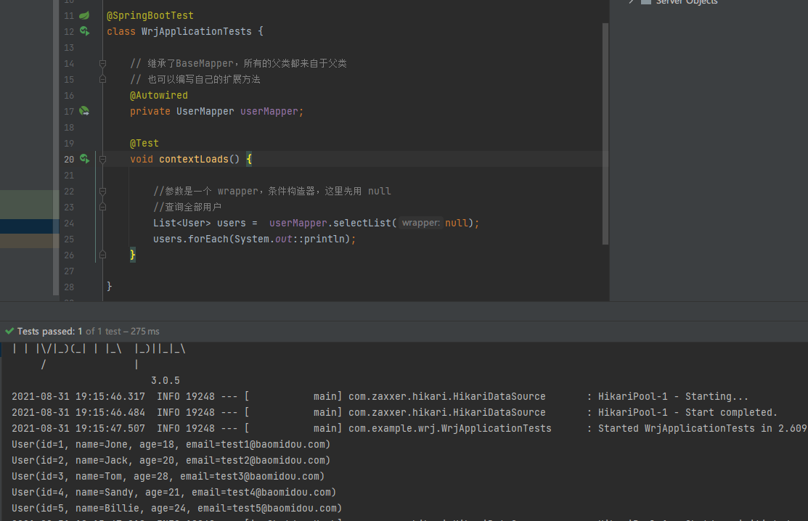
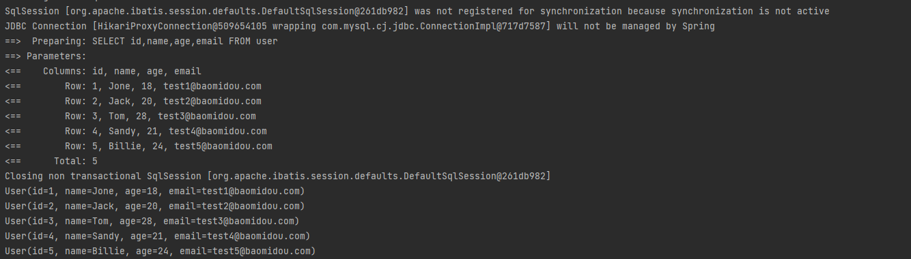
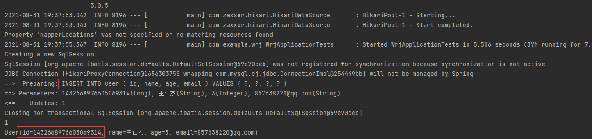
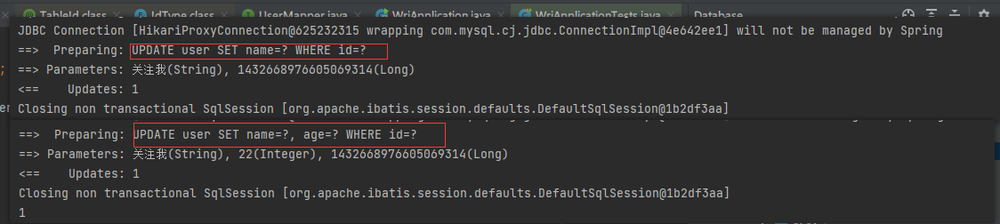

## MyBatis Plus 概述

需要基础：Mybatis、Spring、SpringMVC

所有的 CRUD 代码都可以自动化完成

> 简介

**MyBatis-Plus**（简称 MP）是一个 **MyBatis** 的增强工具，在 **MyBatis** 的基础上只做增强不做改变，为简化开发、提高效率而生。


> 特性

- **无侵入**：只做增强不做改变，引入它不会对现有工程产生影响，如丝般顺滑
- **损耗小**：启动即会自动注入基本 CURD，性能基本无损耗，直接面向对象操作
- **强大的 CRUD 操作**：内置通用 Mapper、通用 Service，仅仅通过少量配置即可实现单表大部分 CRUD 操作，更有强大的条件构造器，满足各类使用需求  
- **支持 Lambda 形式调用**：通过 Lambda 表达式，方便的编写各类查询条件，无需再担心字段写错
- **支持主键自动生成**：支持多达 4 种主键策略（内含分布式唯一 ID 生成器 - Sequence），可自由配置，完美解决主键问题
- **支持 ActiveRecord 模式**：支持 ActiveRecord 形式调用，实体类只需继承 Model 类即可进行强大的 CRUD 操作
- **支持自定义全局通用操作**：支持全局通用方法注入（ Write once, use anywhere ）
- **内置代码生成器**：采用代码或者 Maven 插件可快速生成 Mapper 、 Model 、 Service 、 Controller 层代码，支持模板引擎，更有超多自定义配置等您来使用
- **内置分页插件**：基于 MyBatis 物理分页，开发者无需关心具体操作，配置好插件之后，写分页等同于普通 List 查询
- **分页插件支持多种数据库**：支持 MySQL、MariaDB、Oracle、DB2、H2、HSQL、SQLite、Postgre、SQLServer 等多种数据库
- **内置性能分析插件**：可输出 SQL 语句以及其执行时间，建议开发测试时启用该功能，能快速揪出慢查询
- **内置全局拦截插件**：提供全表 delete 、 update 操作智能分析阻断，也可自定义拦截规则，预防误操作


## 快速入门


使用第三方组件：

+ 导入对应依赖
+ 研究依赖如何配置
+ 代码如何编写
+ 如何扩展技术能力

> 步骤

1.创建数据库  `mybatis_plus` 

2.创建 user 表

```sql
DROP TABLE IF EXISTS user;

CREATE TABLE user
(
	id BIGINT(20) NOT NULL COMMENT '主键ID',
	name VARCHAR(30) NULL DEFAULT NULL COMMENT '姓名',
	age INT(11) NULL DEFAULT NULL COMMENT '年龄',
	email VARCHAR(50) NULL DEFAULT NULL COMMENT '邮箱',
	PRIMARY KEY (id)
);
--  真实开发中，version（乐观锁） deleted（逻辑删除）  gmt_create  gmt_modified  --
```


```sql
-- 插入数据 --
DELETE FROM user;

INSERT INTO user (id, name, age, email) VALUES
(1, 'Jone', 18, 'test1@baomidou.com'),
(2, 'Jack', 20, 'test2@baomidou.com'),
(3, 'Tom', 28, 'test3@baomidou.com'),
(4, 'Sandy', 21, 'test4@baomidou.com'),
(5, 'Billie', 24, 'test5@baomidou.com');
```


3.编写项目，初始化项目，使用 Spring Boot 初始化

4.导入依赖

```xml
<!-- 数据库驱动 -->
<dependency>
    <groupId>mysql</groupId>
    <artifactId>mysql-connector-java</artifactId>
</dependency>

<!-- lombok -->
<dependency>
    <groupId>org.projectlombok</groupId>
    <artifactId>lombok</artifactId>
</dependency>

<!-- MyBatis-Plus 是自己开发的，并非官方的 -->
<dependency>
    <groupId>com.baomidou</groupId>
    <artifactId>mybatis-plus-boot-starter</artifactId>
    <version>3.0.5</version>
</dependency>
```

说明：使用 MyBatis-Plus 可以节省大量的代码，尽量不要同时导入 MyBatis 和 MyBatis-Plus

5.连接数据库

```properties
#mysql 5  驱动不同 com.mysql.jdbc.Driver

#mysql 5  驱动不同 com.mysql.jdbc.Driver 需要增加时区的配置 serverTimezone=GMT%2B8
spring.datasource.username=root
spring.datasource.password=123456
spring.datasource.url=jdbc:mysql://localhost:3306/mybatis_plus?useSSL=false&useUnicode=true&characterEncoding=utf-8&serverTimezone=GMT%2B8
spring.datasource.driver-class-name=com.mysql.cj.jdbc.Driver
```


==6. 传统方式 pojo-dao(连接mybatis，配置mapper.xml文件) -service-controller==

6.使用了 MyBatis-Plus 之后

+ pojo

  ```java
  package com.example.wrj.pojo;
  
  
  import lombok.AllArgsConstructor;
  import lombok.Data;
  import lombok.NoArgsConstructor;
  
  @Data
  @AllArgsConstructor
  @NoArgsConstructor
  public class User {
  
      private Long id;
  
      private String name;
  
      private Integer age;
  
      private String email;
  
  }
  ```

  

+ mapper接口

  ```java
  package com.example.wrj.mapper;
  
  import com.baomidou.mybatisplus.core.mapper.BaseMapper;
  import com.example.wrj.pojo.User;
  import org.springframework.stereotype.Repository;
  
  //在对应的 Mapper 上实现基本的接口
  @Repository   //代表持久层
  public interface UserMapper extends BaseMapper<User> {
      //所有的 CRUD 操作均完成
      //不需要像以前那样配置一堆文件了
  }
  ```

  

+ 需要再主启动类上区扫描 mapper 包下的所有接口 

  ```java
  //扫描 mapper 文件夹
  @MapperScan("com.example.wrj.mapper")
  ```

+ 测试类中测试

  ```java
      // 继承了BaseMapper，所有的父类都来自于父类
      // 也可以编写自己的扩展方法
      @Autowired
      private UserMapper userMapper;
  
      @Test
      void contextLoads() {
  
          //参数是一个 wrapper，条件构造器，这里先用 null
          //查询全部用户
          List<User> users =  userMapper.selectList(null);
          users.forEach(System.out::println);
      }
  ```

+ 结果

  

> 思考问题

1.SQL 谁帮我们写的？

2.方法哪里来的？

## 配置日志

现在所有的 sql 是不可见的，希望知道是怎么执行的，因此需要显示日志

```properties
# 配置日志
mybatis-plus.configuration.log-impl=org.apache.ibatis.logging.stdout.StdOutImpl
```




配置完毕日志之后，后面的学习就需要注意这个自动生成的 SQL


## CRUD 扩展

### 插入操作

```java
    //测试插入
    @Test
    public void testInsert() {
        User user = new User();
        user.setName("王仁杰");
        user.setAge(3);
        user.setEmail("857638220@qq.com");

        int result = userMapper.insert(user);    //帮我们自动生成 id
        System.out.println(result);             //（受影响的行数）（插入了几行）
        System.out.println(user);               //发现 id 会自动回填
    }
```



> 数据库插入的 id 的默认值为：全局的唯一 id

### 主键生成策略

> 默认 ID_WORKER 全局唯一 id

分布式系统唯一 id 生成：https://www.cnblogs.com/haoxinyue/p/5208136.html

#### 雪花算法：

snowflake 是 Twitter 开源的分布式 ID 生成算法，结果是一个 long 型的 ID。其核心思想是：使用 41bit 作为毫秒数，10bit 作为机器的 ID（5 个 bit 是数据中心，5 个 bit 的机器 ID），12bit 作为毫秒内的流水号（意味着每个节点在每毫秒可以产生 4096 个 ID），最后还有一个符号位，永远是 0。 可以保证几乎全球唯一


> 主键自增 auto

我们需要配置主键自增：

1. 实体类字段上 ==@TableId(type = IdType.AUTO)==
2. 数据库字段一定要是自增的！（如果数据库不自增，那么会报错）
3. 再次测试插入即可

> 其余源码解释

```java
public enum IdType {
    AUTO(0),	// 数据库 id 自增
    NONE(1),	// 未设置主键
    INPUT(2),	//手动输入
    ID_WORKER(3),	//默认的全局唯一 id
    UUID(4),		//全局唯一 id 
    ID_WORKER_STR(5);

    private int key;

    private IdType(int key) {
        this.key = key;
    }

    public int getKey() {
        return this.key;
    }
}
```


### 更新操作

```Java
//测试更新
@Test
public void testUpdate(){
    User user = new User();

    //通过条件自动拼接动态 sql
    user.setName("王仁杰");
    user.setId(1432668976605069314L);
    user.setName("关注我");
    user.setAge(22);

    // 注意，updateById 但是参数是一个 对象
    int i = userMapper.updateById(user);
    System.out.println(i);
}
```




所有的 sql 都是自动帮忙配置的


### 自动填充

创建时间、修改时间等操作一般都是自动化完成的，我们不希望手动更新！

阿里巴巴开发手册：所有数据库表：gmt_create、gmt_modified 几乎所有的表都要配置上。而且需要自动化

> 方式一：数据库级别

1. 在表中新增字段 create_time，update_time，并在数据库中设置为自动修改
2. 测试（ps：在工作中不允许使用（因为要修改表））

> 方式二：代码级别

1. 删除数据库的默认值和更新操作

2. 实体类的字段属性上需要增加注解

   ```Java
       // 字段添加填充内容
       @TableField(fill = FieldFill.INSERT)
       private Date createTime;
   
       @TableField(fill = FieldFill.INSERT_UPDATE)
       private Date updateTime;
   
   ```

3. 编写处理其处理注解即可

```java
package com.example.wrj.handler;

import com.baomidou.mybatisplus.core.handlers.MetaObjectHandler;
import lombok.extern.slf4j.Slf4j;
import lombok.extern.slf4j.XSlf4j;
import org.apache.ibatis.reflection.MetaObject;
import org.springframework.stereotype.Component;

import java.util.Date;

@Slf4j
@Component    // 一定不要忘记把处理器加到 IOC 容器中！
public class MyMetaObjectHandler implements MetaObjectHandler {
    //插入时的填充策略
    @Override
    public void insertFill(MetaObject metaObject) {
        log.info("start insert fill......");
        this.setFieldValByName("createTime",new Date(),metaObject);
        this.setFieldValByName("updateTime",new Date(),metaObject);
    }

    //更新时的填充策略
    @Override
    public void updateFill(MetaObject metaObject) {
        log.info("start update fill......");
        this.setFieldValByName("updateTime",new Date(),metaObject);

    }
}
```

4. 测试插入
5. 测试修改，观察时间即可

### TODO 乐观锁

### 查询

```java
   // 测试查询
    @Test
    public void testSelectById(){
        User user = userMapper.selectById(1L);
        System.out.println(user);
    }

    //测试批量查询
    @Test
    public void testSelectBatchIds(){
        List<User> users = userMapper.selectBatchIds(Arrays.asList(4,5,6));
        System.out.println(users);
    }

    // 按条件查询 一，使用map
    @Test
    public void testSelect(){
        HashMap<String,Object> map  = new HashMap<>();
        //自定义查询
        map.put("name","关注我");
        map.put("age",22);

        List<User> users = userMapper.selectByMap(map);
        users.forEach(System.out::println);
    }

```

### 分页查询

分页在网站使用的特别多。

1. 原始的 limit 进行分页
2. pageHelper 第三方插件
3. MP 其实也内置了分页插件

> 如何使用

1. 配置拦截器组件即可

   ```java
   /**
    * 分页插件
    */
   @Bean
   public PaginationInterceptor paginationInterceptor() {
       return new PaginationInterceptor();
   }
   ```

2. 直接使用分页查询


