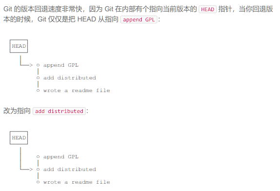
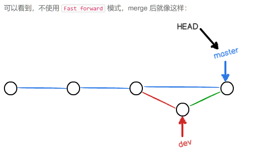

## 安装

### 配置信息

```bash
$git config --global user.name "Wang Renjie"
$git config --global user.email "857638220@qq.com"
```

### 创建版本库

```bash
$git init    # init git, transfer the folder to git respository

$git add git_study  #put the folder into the resposity
				  #when there is no message after the operation,it means success
				  
$git commit -m "create a git_study note" #we add some message

```

### 时光机穿梭.jpg

#### 版本回退

```bash
$git status     #get git status

$git diff      #we can get its use by its name

$ git status
On branch master
nothing to commit, working tree clean

```

```bash
$git log (--pretty oneline)           #show the log   ()option,make the log all in one line
55df8c1bc0335753227b47ea00b07d4590cd5a1e create and write a note about git     #55dfbalabala  is commit id

$git reset --hard HEAD^           #back to the last version   HEAD^^ means last last version,   HEAD~100  last 100 version

$git reset --hard 55df8           #back to the version whose commit id is 55df8c etc

#rollback is fast because git only update the pointer into different version
```



```bash
# if we rollback and want to rollback again, we can use *git feflog* to get our command history the we can get the commit id.
$git reflog
```


#### 工作区和暂存区

Working Directory and Repository

git add command copy the file into the stage (暂存区) of Repository, we can add many times.

the  commit the update into the master(分支) of  respository.


#### 管理修改

git add changes into stage then commit into master

<u>*git manage the changes instead of files.*</u>


#### 撤销修改

```bash
#drop changes in work directory
$git checkout -- file     
#drop the update in working directory
	#if the update has not been put into stage, then it will withdraw to the respository version.
	#if the update has been put into stage and update again, it will withdraw to stage version.
#To sum up, file will return to the last git commit/add version
```

```bash
#drop changes in stage
$git reset HEAD file        #withdraw changes in stage to work directory
$git checkout -- file
```


```bash
git 最新更新
从暂存区恢复工作区，
git resotre --worktree readme.txt

从 master 恢复暂存区 
git restore --staged readme.txt

从 master 同时恢复工作区和暂存区
git restore --source=HEAD --staged --worktree readme.txt
```


#### Delete file

```bash
#delete file in respository
git rm file
git commit -m "delete file"

git rm file
git resotre 
```


### 远程仓库

```bash
$ssh-keygen -t rsa -C "857638220@qq.com"
```

创建完成后可以在用户主目录   /user/windows10/.ssh看到id_rsa和id_rsa.pub两个文件

前者是私钥，后者是公钥。


配置GitHub

在设置中add SSH Key，粘贴id_rsa.pub文件

为了确认是本人推送的分支。

#### 添加远程仓库

先在GitHub上创建远程仓库。

```bash
git remote add origin git@github.com:WangRenjie12138/git_study.git
git push -u origin master

#使用git push 命令，将master分支推送到远程。
#因为远程库是空的，因此加上了-u参数，git会将本地的master分支内容推送到远程新的master分支，并且将两者关联起来。

#此后可以直接使用
git push origin master
```

#### 删除远程库

```bash
git remote -v     #用于查看远程库信息
git remote rm origin    #根据名字删除了origin

#此处删除为解除绑定，物理删除的话则需要登录GitHub进行删除
```


#### 从远程库克隆下来

```bash
git clone git@github.com:WangRenjie12138/git_study.git
```


### 分支管理

协作过程中每个人可以创建自己的分支，并提交在自己的分支上。开发完毕后再合并分支，这样既完成了版本控制，又不影响别人工作

#### 创建与合并分支

本质上分支就是不同的指针

```bash
#创建分支   -b表示创建并切换
git checkout -b dev

#git branch查看分支
git branch

#switch to branch "master"
git checkout master

#将dev分支的工作成果合并到master分支   Fast-forward表示为快进模式（直接把master指针指向dev的此次提交
git merge dev
Updating f5cea15..5aed381
Fast-forward
 git_study/git.md | 85 ++++++++++++++++++++++++++++++++++++++++++++++++++++++--
 1 file changed, 83 insertions(+), 2 deletions(-)

#删除dev
git branch -d dev
```

```bash
#新版git命令
查看分支  git branch
创建分支  git branch <name>
切换分支  git switch <name>
创建+切换 git switch -c <name>
合并某分支到当前分支 git merge <name>
删除分支  git branch -d <name>
```


#### 解决冲突

当两个分支进行了不同的add commit之后，合并时会引发冲突

比如新建一个feature1分支，在此分支上进行了修改，并add和commit

然后切换回master分支，再修改，并add和commit

之后master分支再merge feature1分支时，便会冲突。

git会将冲突标注在文件中

```
<<<<<<<<<<<<<<<<<<<<HEAD
balabala
=================
sdasdadsdad
>>>>>>>>>>>>>>>>>>feature1
```

将此时的文件修改解决后再add 和 commit 一次就可解决冲突。


#### 分支管理策略

一般在合并分支的时候，git会尽量使用fast forward模式。但是此方式中，**删除分支会丢掉分支信息**

如果禁用fast forward模式，则git会在merge的时候生成一个新的commit，在分支历史上就能够看到分支信息

```bash
git switch -c dev

git add 123.txt
git commit -m "add merge"

git switch master

#因为--no-ff模式下，合并会创建一个新的commit，所以使用-m将commit描述写进入 
git merge --no-ff -m "merge with no-ff" dev

git log
```



##### 分支策略

+ master分支应是最稳定的分支（仅仅用来发布新版本，不用于开发）
+ 开发都在dev分支上，当测试完成发布的时候，将dev分支合并到master上。
+ 每个人都有自己的分支，并且不定期在dev分支上合并即可


