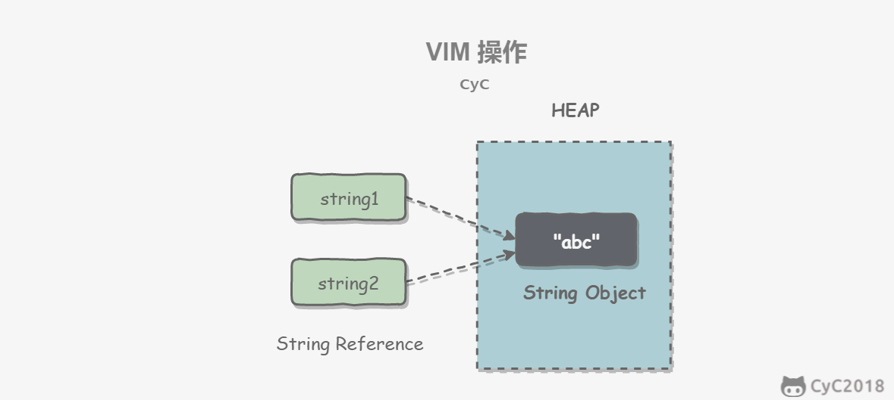

# java基础

## 一.数据类型

### 基本类型

+ byte/8
+ char/16
+ short/16
+ int/32
+ float/32
+ long/64
+ double/64
+ boolean/~

boolean大小未规定，编译时会被转成int，1 表示 true，0 表示 false。数组则是通过byte数组实现

### 包装类型

基本类型都有对应的包装类型。

```java
Integer x = 2;                   //装箱 调用了 Interger.valueOf(2)
int y = x;					   //拆箱，调用了 X.intValue
```

### 缓冲池

new Integer(123) 与 Integer.valueOf(123)的区别在于

+ new Integer(123)每次回新建一个对象
+ Integer.valueOf(123) 会使用缓存池中的对象，多次调用会取得同一个对象的引用。

```java
Integer x = new Integer(123);
Integer y = new Integer(123);
System.out.println(x == y);              //false
Integer z = Integer.valueOf(123);
Integer k = Integer.valueOf(123);
System.out.println(z == k);				//true
```

valueOf()方法：

```java
public static Integer valueOf(int i) {
	if(i >= IntegerCache.low && i <= IntegerCache.high)
		return IntegerCache.cache[i + (-IntegerCache.low)];
	return new Integer(i);
}
```

Java 8 中，Integer缓存池大小默认为 -128~127。

```java
static final int low = -128;
static final int high;
static final Integer cache[];

static {
    // high value may be configured by property
    int h = 127;
    String integerCacheHighPropValue = 
        sun.misc.VM.getSavedProperty("java.lang.IntegerCache.high");
    if(integerCacheHighPropValue != null){
        try {
            int i = parseInt(integerCacheHighPropValue);
            i = Math.max(i, 127);
            // Maximum array size is Integer.MAX_VALUE
            h = Math.min(i, Integer.MAX_VALUE - (-low) -1)
        } catch (NumberFormatException nfe) {
            // If the property cannot be parsed into an int ,ignore it.
        }
    }
    high = h;
    
    cache = new Integer[(high - low) + 1];
    int j = low;
    for(int k = 0; k < cache.length; k++)
        cache[k] = new Integer(j++);
    
    // range [-128,127] must be interned
    assert IntegerCache.high >= 127;
}

```

编译器会自动装箱过程调用 valueOf() 方法，因此多个**值相同**且**值在缓存池范围内**的Integer实例使用自动装箱来创建，会引用相同的对象

```java
Integer m = 123;
Integer n = 123;
System.out.println(m == n);
```

其中，基本类型的缓冲池如下：

+ boolean values **true** and **false**
+ **all** byte values
+ short values between **-128** and **127**
+ int values between **-128** and **127**
+ char in the range **\u0000** to **\u007F**

在使用这些基本类型对应的包装类型时，如果数值范围在缓冲池范围内，就可以直接使用缓存池中的对象。

## 二.String

### 概览

String 被声明为 final，因此它不可被继承。(Interger 等包装类也不能被继承)

在 Java 8 中，String 内部使用 char 数组存储数据

```java
public final class String 
	implements java.io.Serializable, Comparable<String>, CharSequence{
	// The value is used for character storage.
    private final byte[] value;
    
    // The identifier of the encoding used to encode the bytes in {@code value}.
    private final byte coder;
}
```

value 数组被声明为 final，因此一旦初始化之后就不能再引用其他数组。且 String 内部并没有改变 value 数组的方法，可以保证 String 的不可变。

### 不可变的好处

#### 可以缓存hash值

因为 String 的 hash 值经常被使用，比如 String 被用作 HashMap 的 key。不可变的特性可以使得 hash 值也不可辨，只需要一次计算

#### String Pool 的需要

如果一个 String 对象已经被创建过了，那么就会从 String Pool 中取得引用。只有 String 是不可变的，才可能使用 String Pool。



#### 安全性

String 常作为参数，String 的不可变性可以不保证参数的不可变。

#### 线程安全

不可变则天生线程安全

### String, StringBuffer and StringBuilder

#### 1.可变性

+ String 不可变
+ StringBuffer 和 StringBuilder 可变

#### 2.线程安全

+ String 压根不可变，所以线程安全
+ StringBuilder 不是线程安全
+ StringBuffer 是线程安全的，内部使用了 synchronized 进行同步

### String Pool

字符串常量池 (String Pool)  保存着所有**字符串字面量** (literal strings) , 这些字面量再编译时期已经确定，可以使用 String 的 intern() 方法在运行过程中把字符串添加到 String Pool 中。

当一个字符串调用 intern() 方法时，如果 String Pool 中已经存在了一个字符串和该字符串值相同（使用equals（）方法进行确定），那么会返回 String Pool 中字符串的引用；否则在 String Pool 中添加一个新的字符串，然后返回引用。

```java
String s1 = new String("aaa");
String s2 = new String("aaa");
System.out.println(s1 == s2);            //false
String s3 = s1.intern();
String s4 = s2.intern();
System.out.println(s3 == s4);            //true
```

如果以 "bbb" 这种**字面量**的形式创建字符串，会自动放入 String Pool 中。

```java
String s5 = "bbb";
String s6 = "bbb";
System.out.println(s5 == s6);           //true
```

在 Java 7 之前，String Pool 被放在运行时常量池中，它属于永久代。而在 Java 7，String Pool 被移到堆中。因为永久代的空间有限。大量使用字符串的场景下会导致 OutOfMemoryError 错误

### new String("abc")

使用这种方式一共会创建两个字符串对象（前提是 String Pool 中还没有 "abc" 字符串对象）

+ "abc" 属于字符串字面量，因此编译时期会在 String Pool 中创建一个字符串对象，指向这个 "abc" 字符串字面量
+ 而使用 new 的方式会在堆中创建一个字符串对象

## 运算

### 参数传递

Java 的参数传递是以值传递的形式传入方法中，而不是引用传递

```java
public class Dog{
	Srting name;
	
	Dog(String name) {
        this.name = name;
	}
    
    String getName() {
        return this.name;
    }
    
    void setName(String name) {
        this.name = name;
    }
    
    String getObjectAddress(){
		return super.toString();
    }
}

class PassByValueExample{
    public static void main(String[] args) {
        Dog dog = new Dog("A");
        // 在这里传递参数的时候，实际上dog是一个指针，存储的是对象的地址，传参实际上是把对象的地址以值的方式传递
       	func(dog);
        //会改变原字段，因为引用的都是一个对象
        System.out.println(dog.getName());		//B
    }
    
    private static void func(Dog dog) {
        dog.setName("B");
    }
}

```

```java
public class PassByValueExample {
	public static void main(String[] args) {
		Dog dog = new Dog("A");
		System.out.println(dog.getObjectAddress());   //Dog@4554617c
		func(dog);
		System.out.println(dog.getObjectAddress()); // Dog@4554617c
		System.out.println(dog.getName());          // A
	}
    
    private static void func(Dog dog) {
        System.out.println(dog.getObjectAddress()); // Dog@4554617c
        dog = new Dog("B");                    //dog被指向了全新的对象
        System.out.println(dog.getObjectAddress()); // Dog@74a14482
        System.out.println(dog.getName());          // B
    }
}
```

### float and double

Java 不能隐式执行向下转型，因为会使精度降低。

1.1 字面量是double类型，所以不能直接赋给 float

```java
// float f = 1.1;				is wrong
```

1.1f 才是 float 类型

```java
float f = 1.1f;
```

### 隐式类型转换

因为字面量 1 是 int 类型，它比 short 类型精度要高，因此不能隐式地将 int 类型向下转换为 short 类型。

```java
short s1 = 1;
// s1 = s1 + 1;
```

但是使用 += 或者 ++ 运算符会执行隐式类型转换。

```java
s1 += 1;
s1++;
```

上面的语句相当于将 s1 + 1 的结果进行了向下转型:

```java
s1 = (short)(s1 + 1);
```

### switch

从 Java 7 开始，可以在 switch 条件判断语句中使用 String 对象。

```java
String s = "a";
switch (s) {
	case "a":
		System.out.println("aaa");
		break;
	case "b":
		System.out.println("bbb");
		break;
}
```

switch不支持long、float、double，因为 switch 的设计的初衷是对那些只有少数几个值的类型进行等值判断，如果值过于复杂，还是建议使用if。

```java
// long x = 111;
// switch (x) { // Incompatible types. Found: 'long', required: 'char, byte, short, int, Character, Byte, Short, Integer, String, or an enum'
//     case 111:
//         System.out.println(111);
//         break;
//     case 222:
//         System.out.println(222);
//         break;
// }
```

## 关键字

### final

#### 1.数据

生命数据为常量，可以是编译时常量，也可以是在运行时初始化后不能被改变的常量。

+ 对于基本类型，final 使数值不变
+ 对于引用类型，final 使引用不变，也就不能引用其它对象，但是被**引用的对象本身是可以修改的**

#### 2.方法

声明方法不能被子类重写。

private 方法隐式地被指定为 final，如果在子类中定义方法和基类中的一个 private 方法签名相同，此时子类的方法不是重写基类方法，而是在子类中定义了一个新的方法。

#### 3.类

声明类不允许被继承

### static

#### 1.静态变量

+ 静态变量：又称为类变量，这个变量是属于类的，类所有的实例都共享静态变量，可以**直接通过类名访问**，静态变量在内存中只存在**一份**
+ 实例变量：每创建一个实例就会产生一个实例变量，它与该实例同生共死。

```java
public class A {

    private int x;         // 实例变量
    private static int y;  // 静态变量

    public static void main(String[] args) {
        // int x = A.x;  // Non-static field 'x' cannot be referenced from a static context
        A a = new A();
        int x = a.x;
        int y = A.y;
    }
}
```


#### 2.静态方法

静态方法在类加载时就存在了，不依赖任何实例对象。静态方法必须实现，**不能是抽象方法**

```java
public abstract class A {
    public static void func1(){
    }
    // public abstract static void func2();  // Illegal combination of modifiers: 'abstract' and 'static'
}
```

静态方法只能访问所属类的静态字段和静态方法，方法中不能有 this 和 super 关键字，因为这两个关键字与具体对象关联。

```java
public class A {
	private static int x;
	private int y;
	
	public static void func1() {
		int a = x;
		// int b = y;  // Non-static field 'y' cannot be referenced from a static context
         // int b = this.y;     // 'A.this' cannot be referenced from a static context
	}
}
```

#### 3.静态语句块

静态语句块在类初始化时运行一次

```java
public class A {
	static {
		System.out.println("123");
	}
	public tatic void main(String[] args) {
		A a1 = new A();
		A a2 = new A();
	}
}
```

```java
123        //只打印一次123
```

#### 4.静态内部类

非静态内部类依赖于外部类的实例，也就是必须先创建外部类实例，才能用这个外部类实例去创建非静态内部类，静态内部类无需此操作

```java
public class OuterClass {
	
	class InnerClass {
		
	}
	
	static class StaticInnerClass {
	
	}
	
	public static void main(String[] args) {
		// InnerClass InnerClass = new InnerClass();
        OuterClass outerClass = new OuterClass();
        InnerClass innerClass = outerClass.new InnerClass();
        StaticInnerClass staticInnerClass = new StaticInnerClass();
	}
}
```

静态内部类不能访问外部类的非静态的变量和方法。

#### 5.静态导包

在使用静态变量和方法时不再指明 ClassName，从而简化代码，但是可读性会大大降低。

```java
import static com.xxx.ClassName.*
```

#### 6.初始化顺序

```java
public static String staticField = "静态变量";

static {
    System.out.println("静态语句块");
}

public String field = "实例变量";

{
    System.out.println("普通语句块");
}

// 最后才是构造函数的初始化。
public InitialOrderTest() {
    System.out.println("构造函数");
}
```

静态变量 >  静态语句块 > 实例变量 > 普通语句块 > 构造函数

继承：

1. 父类（静态变量、静态语句块）
2. 子类（静态变量、静态语句块）
3. 父类（实例变量、普通语句块）
4. 父类（构造函数）
5. 子类（实例变量、普通语句块）
6. 子类（构造函数）


---

## Object 通用方法

### 概览

```java
public native int hashCode()

public boolean equals(Object obj)

protected native Object clone() throws CloneNotSupportedException

public String toString();

public final native Class<?> getClass();

public void finalize() throws Throwable {}

public final native void notify();

public final native void notifyAll();

public final native void wait(long timeout) throws InterruptedException

public final void wait(long timeout, int nanos) throws InterruptedException
    
public final void wait() throws InterruptedException
```


### equals()

#### 1.等价关系

两个对象具有等价关系，需要满足以下五个条件：

```java
x.equals(x);					//true 自反性

x.equals(y) == y.equals(x);		 // true 对称性

if(x.equals(y) && y.equals(z))
	x.equals(z)					//true 传递性
    
x.equals(y) == x.equals(y)		//true 多次调用 equals() 方法结果不变
    
x.equals(null);      	 		//false 任何不是null的对象的结果都是false
```


#### 2.等价与相等

+ 对于基本类型， == 判断两个值是否相等，基本类型并没有 equals() 方法。
+ 对于引用类型， == 判断两个变量是否引用同一个对象，equals() 判断引用的对象是否等价

```java
Integer x = new Integer(1);
Integer y = new Integer(1);
System.out.println(x.equals(y));		 //true
System.out.println(x == y);				//false
```

#### 3.实现

+ 检查是否为同一个对象的引用，如果是的话直接返回true；
+ 检查是否是同一个类型，如果不是，直接返回false；
+ 将 Object 对象进行转型；
+ 判断每个关键域是否相等。

```java
public class EqualExample {
    private int x;
    private int y;
    private int z;
    
    public EqualExample(int x, int y, int z){
        this.x = x;
        this.y = y;
        this.z = z;
    }
    
    @Override
    public boolean equals(Object o) {
        if (this == o) return true;
        if (o == null || getClass() != o.getClass()) return false;
        
        EqualExample that = EqualExample o;
        
        if(x != that.x) return false;
        if(y != that.y) return false;
        return z == that.z;
    }
}
```


### hashCode()

hashCode() 返回哈希值


