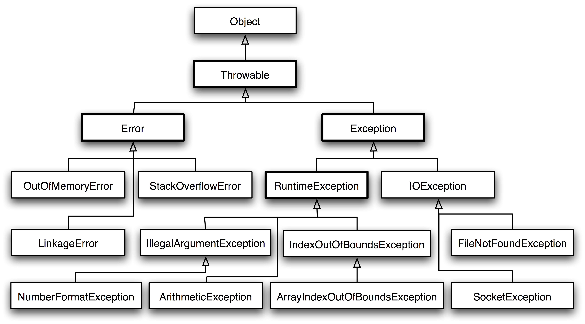

# java基础

## 一.数据类型

### 基本类型

+ byte/8
+ char/16
+ short/16
+ int/32
+ float/32
+ long/64
+ double/64
+ boolean/~

boolean大小未规定，编译时会被转成int，1 表示 true，0 表示 false。数组则是通过byte数组实现

### 包装类型

基本类型都有对应的包装类型。

```java
Integer x = 2;                   //装箱 调用了 Interger.valueOf(2)
int y = x;					   //拆箱，调用了 X.intValue
```

### 缓冲池

new Integer(123) 与 Integer.valueOf(123)的区别在于

+ new Integer(123)每次回新建一个对象
+ Integer.valueOf(123) 会使用缓存池中的对象，多次调用会取得同一个对象的引用。

```java
Integer x = new Integer(123);
Integer y = new Integer(123);
System.out.println(x == y);              //false
Integer z = Integer.valueOf(123);
Integer k = Integer.valueOf(123);
System.out.println(z == k);				//true
```

valueOf()方法：

```java
public static Integer valueOf(int i) {
	if(i >= IntegerCache.low && i <= IntegerCache.high)
		return IntegerCache.cache[i + (-IntegerCache.low)];
	return new Integer(i);
}
```

Java 8 中，Integer缓存池大小默认为 -128~127。

```java
static final int low = -128;
static final int high;
static final Integer cache[];

static {
    // high value may be configured by property
    int h = 127;
    String integerCacheHighPropValue = 
        sun.misc.VM.getSavedProperty("java.lang.IntegerCache.high");
    if(integerCacheHighPropValue != null){
        try {
            int i = parseInt(integerCacheHighPropValue);
            i = Math.max(i, 127);
            // Maximum array size is Integer.MAX_VALUE
            h = Math.min(i, Integer.MAX_VALUE - (-low) -1)
        } catch (NumberFormatException nfe) {
            // If the property cannot be parsed into an int ,ignore it.
        }
    }
    high = h;
    
    cache = new Integer[(high - low) + 1];
    int j = low;
    for(int k = 0; k < cache.length; k++)
        cache[k] = new Integer(j++);
    
    // range [-128,127] must be interned
    assert IntegerCache.high >= 127;
}

```

编译器会自动装箱过程调用 valueOf() 方法，因此多个**值相同**且**值在缓存池范围内**的Integer实例使用自动装箱来创建，会引用相同的对象

```java
Integer m = 123;
Integer n = 123;
System.out.println(m == n);
```

其中，基本类型的缓冲池如下：

+ boolean values **true** and **false**
+ **all** byte values
+ short values between **-128** and **127**
+ int values between **-128** and **127**
+ char in the range **\u0000** to **\u007F**

在使用这些基本类型对应的包装类型时，如果数值范围在缓冲池范围内，就可以直接使用缓存池中的对象。

## 二.String

### 概览

String 被声明为 final，因此它不可被继承。(Interger 等包装类也不能被继承)

在 Java 8 中，String 内部使用 char 数组存储数据

```java
public final class String 
	implements java.io.Serializable, Comparable<String>, CharSequence{
	// The value is used for character storage.
    private final byte[] value;
    
    // The identifier of the encoding used to encode the bytes in {@code value}.
    private final byte coder;
}
```

value 数组被声明为 final，因此一旦初始化之后就不能再引用其他数组。且 String 内部并没有改变 value 数组的方法，可以保证 String 的不可变。

### 不可变的好处

#### 可以缓存hash值

因为 String 的 hash 值经常被使用，比如 String 被用作 HashMap 的 key。不可变的特性可以使得 hash 值也不可辨，只需要一次计算

#### String Pool 的需要

如果一个 String 对象已经被创建过了，那么就会从 String Pool 中取得引用。只有 String 是不可变的，才可能使用 String Pool。


#### 安全性

String 常作为参数，String 的不可变性可以不保证参数的不可变。

#### 线程安全

不可变则天生线程安全

### String, StringBuffer and StringBuilder

#### 1.可变性

+ String 不可变
+ StringBuffer 和 StringBuilder 可变

#### 2.线程安全

+ String 压根不可变，所以线程安全
+ StringBuilder 不是线程安全
+ StringBuffer 是线程安全的，内部使用了 synchronized 进行同步

### String Pool

字符串常量池 (String Pool)  保存着所有**字符串字面量** (literal strings) , 这些字面量再编译时期已经确定，可以使用 String 的 intern() 方法在运行过程中把字符串添加到 String Pool 中。

当一个字符串调用 intern() 方法时，如果 String Pool 中已经存在了一个字符串和该字符串值相同（使用equals（）方法进行确定），那么会返回 String Pool 中字符串的引用；否则在 String Pool 中添加一个新的字符串，然后返回引用。

```java
String s1 = new String("aaa");
String s2 = new String("aaa");
System.out.println(s1 == s2);            //false
String s3 = s1.intern();
String s4 = s2.intern();
System.out.println(s3 == s4);            //true
```

如果以 "bbb" 这种**字面量**的形式创建字符串，会自动放入 String Pool 中。

```java
String s5 = "bbb";
String s6 = "bbb";
System.out.println(s5 == s6);           //true
```

在 Java 7 之前，String Pool 被放在运行时常量池中，它属于永久代。而在 Java 7，String Pool 被移到堆中。因为永久代的空间有限。大量使用字符串的场景下会导致 OutOfMemoryError 错误

### new String("abc")

使用这种方式一共会创建两个字符串对象（前提是 String Pool 中还没有 "abc" 字符串对象）

+ "abc" 属于字符串字面量，因此编译时期会在 String Pool 中创建一个字符串对象，指向这个 "abc" 字符串字面量
+ 而使用 new 的方式会在堆中创建一个字符串对象

## 运算

### 参数传递

Java 的参数传递是以值传递的形式传入方法中，而不是引用传递

```java
public class Dog{
	Srting name;
	
	Dog(String name) {
        this.name = name;
	}
    
    String getName() {
        return this.name;
    }
    
    void setName(String name) {
        this.name = name;
    }
    
    String getObjectAddress(){
		return super.toString();
    }
}

class PassByValueExample{
    public static void main(String[] args) {
        Dog dog = new Dog("A");
        // 在这里传递参数的时候，实际上dog是一个指针，存储的是对象的地址，传参实际上是把对象的地址以值的方式传递
       	func(dog);
        //会改变原字段，因为引用的都是一个对象
        System.out.println(dog.getName());		//B
    }
    
    private static void func(Dog dog) {
        dog.setName("B");
    }
}

```

```java
public class PassByValueExample {
	public static void main(String[] args) {
		Dog dog = new Dog("A");
		System.out.println(dog.getObjectAddress());   //Dog@4554617c
		func(dog);
		System.out.println(dog.getObjectAddress()); // Dog@4554617c
		System.out.println(dog.getName());          // A
	}
    
    private static void func(Dog dog) {
        System.out.println(dog.getObjectAddress()); // Dog@4554617c
        dog = new Dog("B");                    //dog被指向了全新的对象
        System.out.println(dog.getObjectAddress()); // Dog@74a14482
        System.out.println(dog.getName());          // B
    }
}
```

### float and double

Java 不能隐式执行向下转型，因为会使精度降低。

1.1 字面量是double类型，所以不能直接赋给 float

```java
// float f = 1.1;				is wrong
```

1.1f 才是 float 类型

```java
float f = 1.1f;
```

### 隐式类型转换

因为字面量 1 是 int 类型，它比 short 类型精度要高，因此不能隐式地将 int 类型向下转换为 short 类型。

```java
short s1 = 1;
// s1 = s1 + 1;
```

但是使用 += 或者 ++ 运算符会执行隐式类型转换。

```java
s1 += 1;
s1++;
```

上面的语句相当于将 s1 + 1 的结果进行了向下转型:

```java
s1 = (short)(s1 + 1);
```

### switch

从 Java 7 开始，可以在 switch 条件判断语句中使用 String 对象。

```java
String s = "a";
switch (s) {
	case "a":
		System.out.println("aaa");
		break;
	case "b":
		System.out.println("bbb");
		break;
}
```

switch不支持long、float、double，因为 switch 的设计的初衷是对那些只有少数几个值的类型进行等值判断，如果值过于复杂，还是建议使用if。

```java
// long x = 111;
// switch (x) { // Incompatible types. Found: 'long', required: 'char, byte, short, int, Character, Byte, Short, Integer, String, or an enum'
//     case 111:
//         System.out.println(111);
//         break;
//     case 222:
//         System.out.println(222);
//         break;
// }
```

## 关键字

### final

#### 1.数据

生命数据为常量，可以是编译时常量，也可以是在运行时初始化后不能被改变的常量。

+ 对于基本类型，final 使数值不变
+ 对于引用类型，final 使引用不变，也就不能引用其它对象，但是被**引用的对象本身是可以修改的**

#### 2.方法

声明方法不能被子类重写。

private 方法隐式地被指定为 final，如果在子类中定义方法和基类中的一个 private 方法签名相同，此时子类的方法不是重写基类方法，而是在子类中定义了一个新的方法。

#### 3.类

声明类不允许被继承

### static

#### 1.静态变量

+ 静态变量：又称为类变量，这个变量是属于类的，类所有的实例都共享静态变量，可以**直接通过类名访问**，静态变量在内存中只存在**一份**
+ 实例变量：每创建一个实例就会产生一个实例变量，它与该实例同生共死。

```java
public class A {

    private int x;         // 实例变量
    private static int y;  // 静态变量

    public static void main(String[] args) {
        // int x = A.x;  // Non-static field 'x' cannot be referenced from a static context
        A a = new A();
        int x = a.x;
        int y = A.y;
    }
}
```


#### 2.静态方法

静态方法在类加载时就存在了，不依赖任何实例对象。静态方法必须实现，**不能是抽象方法**

```java
public abstract class A {
    public static void func1(){
    }
    // public abstract static void func2();  // Illegal combination of modifiers: 'abstract' and 'static'
}
```

静态方法只能访问所属类的静态字段和静态方法，方法中不能有 this 和 super 关键字，因为这两个关键字与具体对象关联。

```java
public class A {
	private static int x;
	private int y;
	
	public static void func1() {
		int a = x;
		// int b = y;  // Non-static field 'y' cannot be referenced from a static context
         // int b = this.y;     // 'A.this' cannot be referenced from a static context
	}
}
```

#### 3.静态语句块

静态语句块在类初始化时运行一次

```java
public class A {
	static {
		System.out.println("123");
	}
	public tatic void main(String[] args) {
		A a1 = new A();
		A a2 = new A();
	}
}
```

```java
123        //只打印一次123
```

#### 4.静态内部类

非静态内部类依赖于外部类的实例，也就是必须先创建外部类实例，才能用这个外部类实例去创建非静态内部类，静态内部类无需此操作

```java
public class OuterClass {
	
	class InnerClass {
		
	}
	
	static class StaticInnerClass {
	
	}
	
	public static void main(String[] args) {
		// InnerClass InnerClass = new InnerClass();
        OuterClass outerClass = new OuterClass();
        InnerClass innerClass = outerClass.new InnerClass();
        StaticInnerClass staticInnerClass = new StaticInnerClass();
	}
}
```

静态内部类不能访问外部类的非静态的变量和方法。

#### 5.静态导包

在使用静态变量和方法时不再指明 ClassName，从而简化代码，但是可读性会大大降低。

```java
import static com.xxx.ClassName.*
```

#### 6.初始化顺序

```java
public static String staticField = "静态变量";

static {
    System.out.println("静态语句块");
}

public String field = "实例变量";

{
    System.out.println("普通语句块");
}

// 最后才是构造函数的初始化。
public InitialOrderTest() {
    System.out.println("构造函数");
}
```

静态变量 >  静态语句块 > 实例变量 > 普通语句块 > 构造函数

继承：

1. 父类（静态变量、静态语句块）
2. 子类（静态变量、静态语句块）
3. 父类（实例变量、普通语句块）
4. 父类（构造函数）
5. 子类（实例变量、普通语句块）
6. 子类（构造函数）


---

## Object 通用方法

### 概览

```java
public native int hashCode()

public boolean equals(Object obj)

protected native Object clone() throws CloneNotSupportedException

public String toString();

public final native Class<?> getClass();

public void finalize() throws Throwable {}

public final native void notify();

public final native void notifyAll();

public final native void wait(long timeout) throws InterruptedException

public final void wait(long timeout, int nanos) throws InterruptedException
    
public final void wait() throws InterruptedException
```


### equals()

#### 1.等价关系

两个对象具有等价关系，需要满足以下五个条件：

```java
x.equals(x);					//true 自反性

x.equals(y) == y.equals(x);		 // true 对称性

if(x.equals(y) && y.equals(z))
	x.equals(z)					//true 传递性
    
x.equals(y) == x.equals(y)		//true 多次调用 equals() 方法结果不变
    
x.equals(null);      	 		//false 任何不是null的对象的结果都是false
```


#### 2.等价与相等

+ 对于基本类型， == 判断两个值是否相等，基本类型并没有 equals() 方法。
+ 对于引用类型， == 判断两个变量是否引用同一个对象，equals() 判断引用的对象是否等价

```java
Integer x = new Integer(1);
Integer y = new Integer(1);
System.out.println(x.equals(y));		 //true
System.out.println(x == y);				//false
```

#### 3.实现

+ 检查是否为同一个对象的引用，如果是的话直接返回true；
+ 检查是否是同一个类型，如果不是，直接返回false；
+ 将 Object 对象进行转型；
+ 判断每个关键域是否相等。

```java
public class EqualExample {
    private int x;
    private int y;
    private int z;
    
    public EqualExample(int x, int y, int z){
        this.x = x;
        this.y = y;
        this.z = z;
    }
    
    @Override
    public boolean equals(Object o) {
        if (this == o) return true;
        if (o == null || getClass() != o.getClass()) return false;
        
        EqualExample that = EqualExample o;
        
        if(x != that.x) return false;
        if(y != that.y) return false;
        return z == that.z;
    }
}
```


### hashCode()

hashCode() 返回哈希值，而 equals() 是用来判断两个对象是否等价。等价的两个对象 hash 值一定相同，但是 hash 值相同的两个对象不一定等价，这是因为计算哈希值具有随机性，两个值不同的对象可能计算出相同的 hash 值。

重写 equals() 方法的时候应该同时重写 hashCode() 方法，保证等价的两个对象 hash 值也相等。

因为 HashSet 和 HashMap 等集合类使用 hashCode() 方法来计算对象应该存储的位置，所以如果要添加对象到这些集合类中，应该使对应的类实现 hashCode() 方法

```java
EqualExample e1 = new EqualExample(1, 1, 1);
EqualExample e2 = new EqualExample(1, 1, 1);
System.out.println(e1.equals(e2));			//true
HashSet<EqualExample> set = new HashSet<>();
set.add(e1);
set.add(e2);
System.out.println(set.size());               //2

// 重写了 equals 方法，因此那个判断是true。
// 但是没有添加 hashCode 方法，所以 hashSet 在计算值的时候认为这俩不相等，都放进去了。
```


### toString()

```java
public class ToStringExample {

    private int number;

    public ToStringExample(int number) {
        this.number = number;
    }
}

ToStringExample example = new ToStringExample(123);
System.out.println(example.toString());

// 输出： ToStringExample@4554617c
// @后的数值为 hash 码的无符号十六进制表示
```


### clone()

#### 1.cloneable

clone() 是 Object 的 protect 方法，而不是 public 方法，一个类不显式去重写 clone()，那么其它类就不能直接调用该类实例的 clone() 方法

```java
public class CloneExample {
    private int a;
    private int b;
}

// 其他类中：
CloneExample e1 = new CloneExample();
// CloneExample e2 = e1.clone(); // 'clone()' has protected access in 'java.lang.Object'
```

重写 clone() 

```java
public class CloneExample {
	private int a;
	private int b;
	
	@Override
	public CloneExample clone() throws CloneNotSupportedException {
        return (CloneExample)super.clone();
    }
}
```

```java
CloneExample e1 = new CloneExample();
try{
    CloneExample e2 = e1.clone();
} catch(CloneNotSupportedException e) {
    e.printStackTrace();
}

// 报错 java.lang.CloneNotSupportedException: CloneExample
```

因为 CloneExample 没有实现 Cloneable 接口

但是，clone() 方法并不是 Cloneable 接口的方法，而是 Object 的一个 protected 方法。Cloneable 接口规定了，入股一个类没有实现 Cloneable 接口就调用了 clone() 方法，就会抛出该异常

```java
// **继承了 clone 接口**
public class CloneExample implements Cloneable {
    private int a;
    private int b;

    @Override
    public Object clone() throws CloneNotSupportedException {
        return super.clone();
    }
}
```

#### 2.浅拷贝

拷贝对象和原始对象的引用类型**引用同一个对象**。

```java
public class ShallowCloneExample implements Cloneable{
	
    private int[] arr;
    
    public ShallowCloneExample() {
        arr = new int[10];
        for (int i = 0; i < arr.length; i++) {
            arr[i] = i;
        }
    }
    
    public void set(int index, int value) {
        arr[index] = value;
    }
    
    public int get(int index) {
        return arr[index];
    }
    
    @Override
    protected ShallowCloneExample clone() throws CloneNotSupportedException {
        return (ShallowCloneExample) super.clone();
    }
}
// Object类默认实现的是浅拷贝，因为并不清楚子类的数据类型，所以实现的只能是引用地址的拷贝
```

```java
ShallowCloneExample e1 = new ShallowCloneExample();
ShallowCloneExample e2 = null;
try {
    e2 = e1.clone();
} catch (CloneNotSupportedException e) {
    e.printStackTrace();
}
e1.set(2, 222);
System.out.println(e2.get(2));      // 222  e1变了之后e2会跟着改变
```

#### 深拷贝

拷贝对象和原始对象的引用不同的对象。  简而言之，就是复制了一个一模一样拥有自己空间的对象

```java
public class DeepCloneExample implements Cloneable {

    private int[] arr;

    public DeepCloneExample() {
        arr = new int[10];
        for (int i = 0; i < arr.length; i++) {
            arr[i] = i;
        }
    }

    public void set(int index, int value) {
        arr[index] = value;
    }

    public int get(int index) {
        return arr[index];
    }

    @Override
    protected DeepCloneExample clone() throws CloneNotSupportedException {
        DeepCloneExample result = (DeepCloneExample) super.clone();
        result.arr = new int[arr.length];
        for (int i = 0; i < arr.length; i++) {
            result.arr[i] = arr[i];
        }
        return result;
    }
}
```

```java
DeepCloneExample e1 = new DeepCloneExample();
DeepCloneExample e2 = null;
try {
    e2 = e1.clone();
} catch (CloneNotSupportedException e) {
    e.printStackTrace();
}
e1.set(2, 222);
System.out.println(e2.get(2)); // 2
```

#### clone() 的替代方案

因为使用 clone() 方法来拷贝一个对象既复杂又有风险，它会抛出异常，而且还需要类型转换。

因此可以使用拷贝构造函数或者拷贝工厂来拷贝对象。

```java
public class CloneConstructorExample {

    private int[] arr;

    public CloneConstructorExample() {
        arr = new int[10];
        for (int i = 0; i < arr.length; i++) {
            arr[i] = i;
        }
    }

    // 拷贝构造函数
    public CloneConstructorExample(CloneConstructorExample original) {
        arr = new int[original.arr.length];
        for (int i = 0; i < original.arr.length; i++) {
            arr[i] = original.arr[i];
        }
    }

    public void set(int index, int value) {
        arr[index] = value;
    }

    public int get(int index) {
        return arr[index];
    }
}
```

```java
CloneConstructorExample e1 = new CloneConstructorExample();
CloneConstructorExample e2 = new CloneConstructorExample(e1);
e1.set(2, 222);
System.out.println(e2.get(2));       	// 2
```


## 六.继承

### 访问权限

Java 中有三个访问权限修饰符：private  protect   public ，如果不加访问修饰符的话，则默认级可见。

可以对类/类中成员（字段和方法）加上访问修饰符。

+ 类可见表示其它类可以使用这个类创建实例对象
+ 成员可见表示其它类可以使用这个类的实例对象访问到成员

protected 用于修饰成员，表示在继承体系中成员对于子类可见，但是这个**访问修饰符对类没有意义**。

如果子类的方法重写了父类的方法，那么子类中该方法的访问级别不允许低于父类的访问级别。这是为了确保可以使用父类实例的地方都可以使用子类实例去代替，也就是确保满足里氏替换原则。

字段决不能是公有的，因为这么做的话就失去了对这个字段修改行为的控制，客户端可以对其随意修改。

可以使用公有的 getter 和 setter 方法来替换公有字段

```java
public class AccessExample {

    private int id;

    public String getId() {
        return id + "";
    }

    public void setId(String id) {
        this.id = Integer.valueOf(id);
    }
}
```

如果是包级私有的类或者私有的嵌套类，那么直接暴露成员不会有特别大的影响。

```java
public class AccessWithInnerClassExample {

    private class InnerClass {
        int x;
    }

    private InnerClass innerClass;

    public AccessWithInnerClassExample() {
        innerClass = new InnerClass();
    }

    public int getValue() {
        return innerClass.x;  // 直接访问
    }
}
```

### 抽象类与接口

#### 抽象类

抽象类与抽象方法都使用 abstract 关键字进行声明，如果一个类中包含抽象方法，那么这个类必须声明为抽象类。

**抽象类不能被实例化，只能被继承**

```java
public abstract class AbstractClassExample {

    protected int x;
    private int y;

    public abstract void func1();

    public void func2() {
        System.out.println("func2");
    }
}
```

```java
public class AbstractExtendClassExample extends AbstractClassExample {
    @Override
    public void func1() {
        System.out.println("func1");
    }
}
```

```java
// AbstractClassExample ac1 = new AbstractClassExample(); // 'AbstractClassExample' is abstract; cannot be instantiated
AbstractClassExample ac2 = new AbstractExtendClassExample();
ac2.func1();
```

#### 接口

接口是抽象类的延伸，在 Java 8 之前，它可以看成是一个完全抽象的类，也就是说它不能有任何的方法实现。

从 Java 8 开始，接口也可以拥有默认的方法实现，这是因为不支持默认方法的接口的维护成本太高了。在 Java 8 之前，如果一个接口想要添加新的方法，那么要修改所有实现了该接口的类，让它们都实现新增的方法。

接口的成员（字段 + 方法）默认都是 public 的，并且不允许定义为 private 或者 protected。从 Java 9 开始，允许将方法定义为 private，这样就能定义某些复用的代码又不会把方法暴露出去。

接口的字段默认都是 static 和 final 的。(只供接口自身使用，不允许修改，且必须赋值)

```java
public interface InterfaceExample {
    
    void func1();
    
    default void func2() {
        System.out.println("func2");
	}
    
    int x = 123;
    // int y;                  //变量y必须初始化（final）
    public int z = 0;			// 多余的，默认就一定是public
    // private int k = 0;  	 	// Modifier 'private' not allowed here
    // protected int l = 0; 	// Modifier 'protected' not allowed here
    // private void fun3(); 	// Modifier 'private' not allowed here
    
}
	
```

#### 比较

+ 在设计层面上，抽象类提供了 IS-A 关系，需要满足里氏替换原则，即子类对象必须能够替换掉所有的父类对象。而接口更像是一种 LIKE-A 关系，它只是提供了一种方法实现契约，并不要求接口和实现接口的类具有 IS-A 关系
+ 一个类可以使用多个接口，但是不能继承多个抽象类
+ 接口的字段只能是 static 和 final 类型的，而抽象类 字段没有这种限制。
+ 接口的成员只能是 public 的，而抽象类的成员可以有多种访问权限。

#### 使用选择

使用接口：

- 需要让不相关的类都实现一个方法，例如不相关的类都可以实现 Comparable 接口中的 compareTo () 方法；
- 需要使用多重继承。

使用抽象类：

- 需要在几个相关的类中共享代码。
- 需要能控制继承来的成员的访问权限，而不是都为 public。
- 需要继承非静态和非常量字段。


在很多情况下，接口优先于抽象类。因为接口没有抽象类严格的类层次结构要求，可以灵活地为一个类添加行为。并且从 Java 8 开始，接口也可以有默认的方法实现，使得修改接口的成本也变的很低。


### super

+ 访问父类的构造函数，可以使用 super() 函数访问父类的构造函数，从而委托父类完成一些初始化工作。应该注意到，子类一定会调用父类的构造函数来完成初始化工作，一般是调用父类的默认构造函数，如果子类需要调用父类其它构造函数，那么就可以使用 super () 函数。
+ 访问父类的成员，如果子类重写了父类的某个方法，可以通过使用 super 关键字来引用父类的方法实现。

```java
public class SuperExample {

    protected int x;
    protected int y;

    public SuperExample(int x, int y) {
        this.x = x;
        this.y = y;
    }

    public void func() {
        System.out.println("SuperExample.func()");
    }
}
```

```java
public class SuperExtendExample extends SuperExample {

    private int z;

    public SuperExtendExample(int x, int y, int z) {
        super(x, y);
        this.z = z;
    }

    @Override
    public void func() {
        super.func();
        System.out.println("SuperExtendExample.func()");
    }
}
```


### 重写与重载

#### 1.重写(override)

存在于继承体系中，指子类实现了一个与父类在方法声明上完全相同的一个方法。

为了满足里式替换原则，重写有以下三个限制：

- 子类方法的访问权限必须**大于等于**父类方法；
- 子类方法的返回类型必须是父类方法返回类型或为其**子类型**。
- 子类方法抛出的异常类型必须是父类抛出**异常类型**或为其**子类型**。

使用 **@Override** 注解，可以让编译器帮忙检查是否满足上面的三个限制条件。

下面的示例中，SubClass 为 SuperClass 的子类，SubClass 重写了 SuperClass 的 func() 方法。其中：

- 子类方法访问权限为 public，大于父类的 protected。
- 子类的返回类型为 **ArrayList<Integer>**，是父类返回类型 **List<Integer>** 的子类。
- 子类抛出的异常类型为 Exception，是父类抛出异常 Throwable 的子类。
- 子类重写方法使用 @Override 注解，从而让编译器自动检查是否满足限制条件。

---

在调用一个方法时，先从本类中查找看是否有对应的方法，如果没有再到父类中查看，看是否从父类继承来。否则就要对参数进行转型，转成父类之后看是否有对应的方法。总的来说，方法调用的优先级为：

+ this.func(this)
+ super.func(this)
+ this.func(super)
+ super.func(super)

```java
/*
    A
    |
    B
    |
    C
    |
    D
 */


class A {

    public void show(A obj) {
        System.out.println("A.show(A)");
    }

    public void show(C obj) {
        System.out.println("A.show(C)");
    }
}

class B extends A {

    @Override
    public void show(A obj) {
        System.out.println("B.show(A)");
    }
}

class C extends B {
}

class D extends C {
}
```

```java
public static void main(String[] args) {

    A a = new A();
    B b = new B();
    C c = new C();
    D d = new D();

    // 在 A 中存在 show(A obj)，直接调用
    a.show(a); // A.show(A)
    // 在 A 中不存在 show(B obj)，将 B 转型成其父类 A
    a.show(b); // A.show(A)
    // 在 B 中存在从 A 继承来的 show(C obj)，直接调用
    b.show(c); // A.show(C)
    // 在 B 中不存在 show(D obj)，但是存在从 A 继承来的 show(C obj)，将 D 转型成其父类 C
    b.show(d); // A.show(C)

    // 引用的还是 B 对象，所以 ba 和 b 的调用结果一样
    A ba = new B();
    ba.show(c); // A.show(C)
    ba.show(d); // A.show(C)
}
```

#### 2.重载

存在于同一个类中，指一个方法与已经存在的方法名称上相同，但是参数类型、个数、顺序至少有一个不同。

应该注意的是，返回值不同，其它都相同不算是重载。


## 七.反射

每个类都有一个 **Class** 对象，包含了与类有关的信息。当编译一个新类时，会产生一个同名的 .class 文件，该文件内容保存着 Class 对象。

类加载相当于 Class 对象的加载，类在第一次使用时才动态加载到 JVM 中。也可以使用 `Class.forName("com.mysql.jdbc.Driver")` 这种方式来控制类的加载，该方法会返回一个 Class 对象。

反射可以提供运行时的类信息，并且这个类可以在运行时才加载进来，甚至在编译时期该类的 .class 不存在也可以加载进来。

Class 和 java.lang.reflect 一起对反射提供了支持，java.lang.reflect 类库主要包含了以下三个类：

- **Field** ：可以使用 get() 和 set() 方法读取和修改 Field 对象关联的字段；
- **Method** ：可以使用 invoke() 方法调用与 Method 对象关联的方法；
- **Constructor** ：可以用 Constructor 的 newInstance() 创建新的对象。

**反射的优点：**

- **可扩展性** ：应用程序可以利用全限定名创建可扩展对象的实例，来使用来自外部的用户自定义类。
- **类浏览器和可视化开发环境** ：一个类浏览器需要可以枚举类的成员。可视化开发环境（如 IDE）可以从利用反射中可用的类型信息中受益，以帮助程序员编写正确的代码。
- **调试器和测试工具** ： 调试器需要能够检查一个类里的私有成员。测试工具可以利用反射来自动地调用类里定义的可被发现的 API 定义，以确保一组测试中有较高的代码覆盖率。

**反射的缺点：**

尽管反射非常强大，但也不能滥用。如果一个功能可以不用反射完成，那么最好就不用。在我们使用反射技术时，下面几条内容应该牢记于心。

- **性能开销** ：反射涉及了动态类型的解析，所以 JVM 无法对这些代码进行优化。因此，反射操作的效率要比那些非反射操作低得多。我们应该避免在经常被执行的代码或对性能要求很高的程序中使用反射。
- **安全限制** ：使用反射技术要求程序必须在一个没有安全限制的环境中运行。如果一个程序必须在有安全限制的环境中运行，如 Applet，那么这就是个问题了。
- **内部暴露** ：由于反射允许代码执行一些在正常情况下不被允许的操作（比如访问私有的属性和方法），所以使用反射可能会导致意料之外的副作用，这可能导致代码功能失调并破坏可移植性。反射代码破坏了抽象性，因此当平台发生改变的时候，代码的行为就有可能也随着变化。


虽然但是，还是没懂

---

## 异常



Throwable可以用来表示任何可以作为异常抛出的类，分为 Error 和Exception。其中 Error 用来表示JVM无法处理的错误，Exception分为两种：

+ 受检异常：需要要 try...catch... 语句捕获并进行处理，并且可以从异常中恢复
+ 非受检异常：是程序运行时错误，例如除 0 会引发 Arithmetic Exception，此时程序崩溃并且无法恢复。

## 九.泛型

```java
public class Box<T> {
    // T stands for "Type"
    private T t;
    public void set(T t) { this.t = t; }
    public T get() { return t; }
}
```

