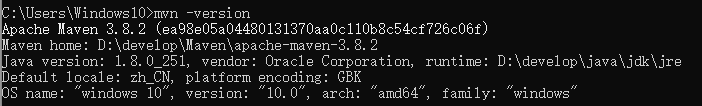
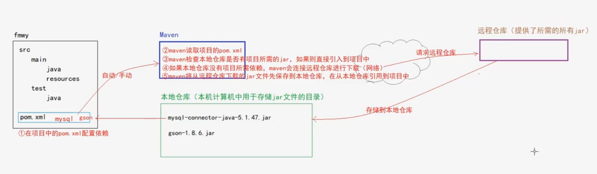
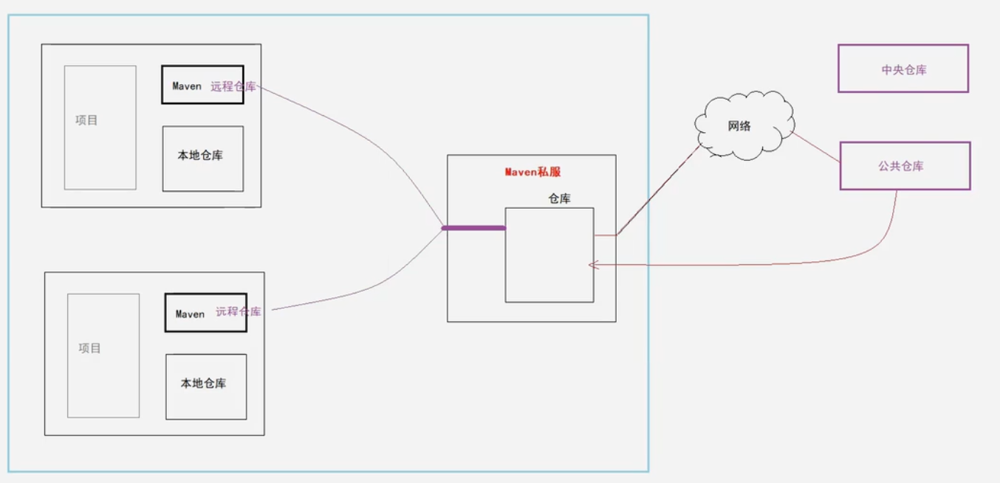
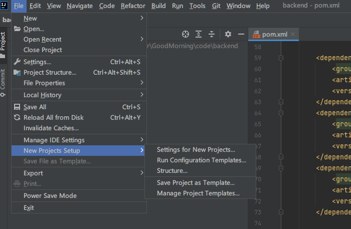
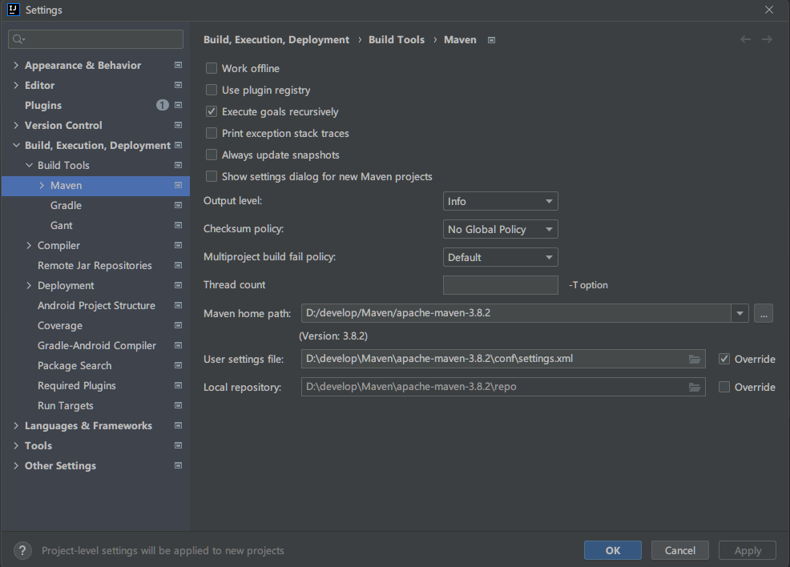
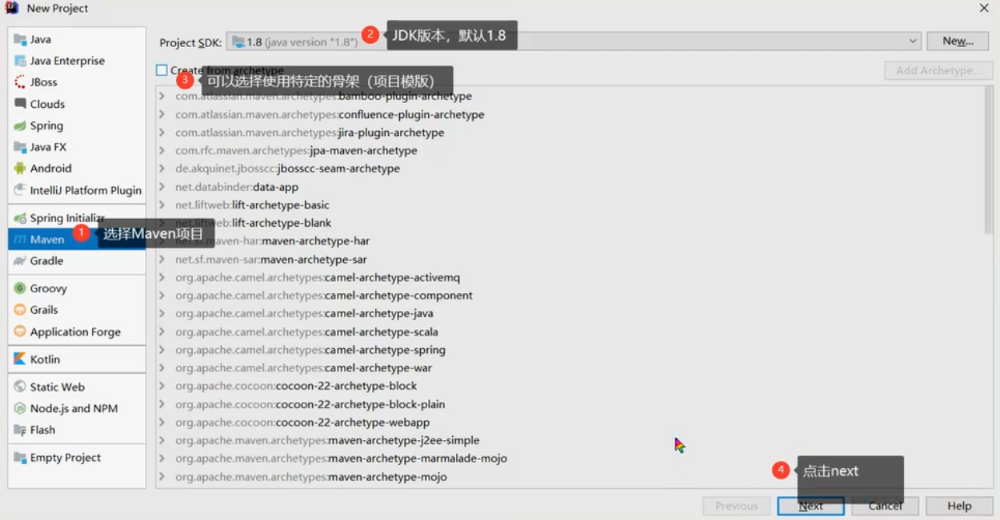
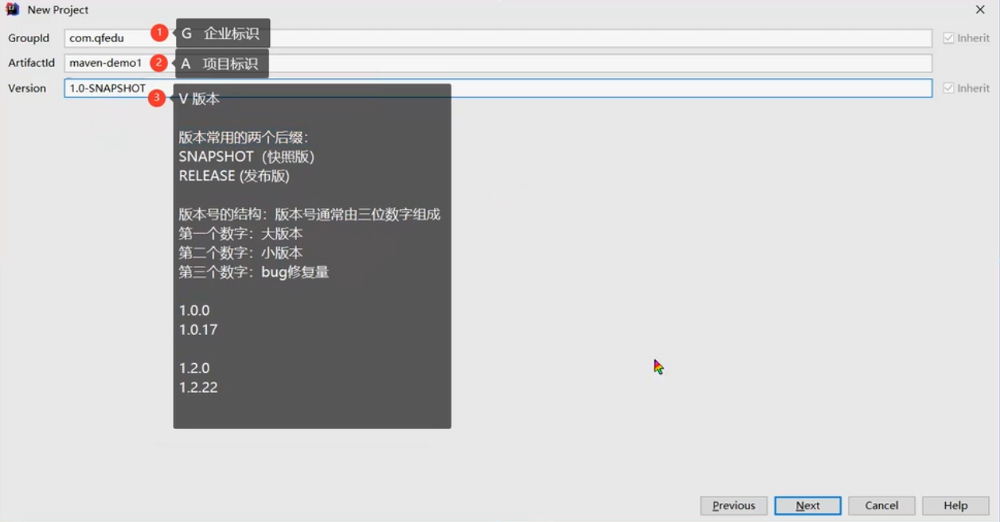
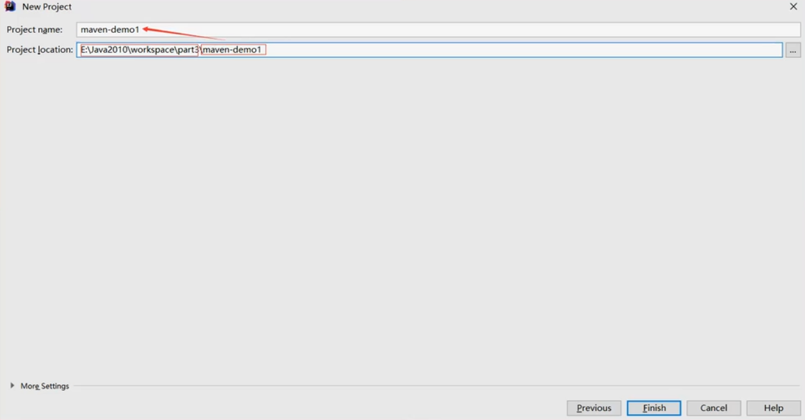
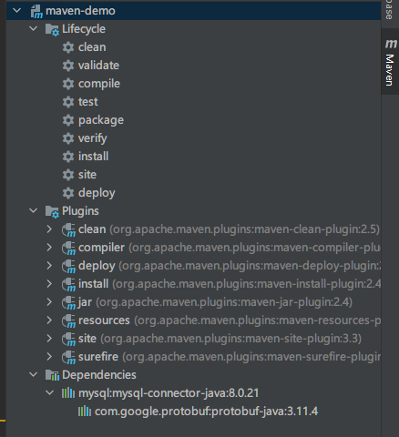

# Maven

## 一、Maven 简介

### 1.1 在项目中如何导入 jar 包

+ 下载 jar 包（通过mvn）
+ 将下载的 jar 包拷贝到项目中（WEB-INF/lib）
+ 选择 jar 文件 -- 右键 -- Add as Library

### 1.2 传统导入 jar 包的方式存在的问题

+ 步骤相对较多  --  `繁琐`
+ 在不同的项目中如果需要相同的 jar 包，需要分别存储这个 jar 文件 -- `冗余`、`项目体积大`
+ 在不同环境下可能因为 jar 文件版本不一致导致项目无法运行（重新配置） -- `移植性差`

### 1.3 项目生命周期

> 项目从编译到运行的整个过程
>
> 完整的生命周期：清理缓存 -- 校验 -- 编译 -- 测试 -- 打包 -- 安装（ war 包安装到服务器） -- 部署

+ IDEA 提供了一键构建项目的功能，但是如果我们需要自定义的生命周期管理，但是没有现成的工具（如清理缓存、打包）

### 1.4 Maven 简介

> Maven 是一个 `基于项目对象模型(POM)进行项目的依赖管理、生命周期管理的`工具软件

**核心功能**

+ 依赖（jar包）管理

+ 生命周期管理

+ 聚合工程

## 二、Maven的安装及配置

### 2.1 Maven 下载

+ https://maven.apache.org/download.cgi

### 2.2 Maven 安装

> Maven 是基于 Java 语言开发，因此依赖 JDK
>
> 开箱即用：直接解压即可

+ 解压( d:/develop/Maven )
+ 目录结构
  + bin  存放指令文件（Maven 提供了一个 mvn 指令）
  + boot  包含了一个类加载框架的 jar 文件
  + conf  包含了 Maven 的核心配置文件 ==settings.xml==
  + lib  存放了 Maven 运行所需的 jar 文件

### 2.3 配置环境变量

+ `MAVEN_HOME`    D:\develop\Maven\apache-maven-3.8.2
+ `Path`   添加  %MAVEN_HOME%\bin

| 测试                                                         |
| ------------------------------------------------------------ |
|  |

## 三、Maven的项目结构

> 使用 Maven 进行项目管理时，无论使用什么开发工具 (eclipse/idea)，项目的结构是统一的

### 3.1 Maven 

```
wrj_Maven（项目名称)
--src
  --main (存放项目源文件)
    --java (存放java代码，相当于传统项目中的 src 目录)
    --resources (存放配置文件和静态资源目录，相当于传统项目中的 web 目录)
  --test (存放项目的单元测试代码)
    --java  (测试代码)
--pom.xml
```

### 3.2 pom.xml

> POM Project Object Model，Maven 可以根据 pom 文件的配置对此项目进行依赖管理。项目中需要的依赖，直接在 pom.xml 进行配置即可

```xml
<?xml version="1.0" encoding="utf-8"?>
<!-- project标签中为该 pom.xml 的组织规范，不添加的话写错了格式不会提示 -->
<project xmlns="http://maven.apache.org/POM/4.0.0" 
         xmlns:xsi="http://www.w3.org/2001/XMLSchema-instance" 
         xsi:schemaLocation="http://maven.apache.org/POM/4.0.0 http://maven.apache.org/xsd/maven-4.0.0.xsd">
    
	<!-- 指定项目模型版本 -->
    <modelVersion>4.0</modelVersion>
    <!-- 指定项目的标识，G 企业标识 A 项目标识 V 版本 -->
    <groupId>com.wrj</groupId>
    <artifactId>wrj_maven</artifactId>
    <version>1.0.0</version>
	
    <!-- 配置当前项目的依赖 -->
    <dependencies>
        
        <!-- https://mvnrepository.com/artifact/mysql/mysql-connector-java -->
        <dependency>
            <groupId>mysql</groupId>
            <artifactId>mysql-connector-java</artifactId>
            <version>8.0.21</version>
        </dependency>
    </dependencies>
</project>
```

> 如果需要在当前项目中添加依赖，只需要在 pom.xml 文件中进行依赖配置即可

**配置依赖**  找到依赖的坐标，只需要在 ==<dependencies>== 标签下添加==<dependency>==即可

```xml
<!-- https://mvnrepository.com/artifact/mysql/mysql-connector-java -->
<dependency>
    <groupId>mysql</groupId>
    <artifactId>mysql-connector-java</artifactId>
    <version>8.0.21</version>
</dependency>
```

## 四、依赖管理

### 4.1 Maven 依赖管理的流程



### 4.2 Maven 仓库管理

+ ==本地仓库==  就是本地计算机上的某个文件夹（可以是自定义的任何文件夹）
+ ==远程仓库==  远程主机上的 jar  文件仓库
  + `中央仓库`  maven 官方提供的仓库，包含了所需的一切依赖（免配置）
  + `公共仓库`  除了中央仓库以外的第三方仓库都是公共仓库，例如 aliyun （需要配置）
  + `私服`  企业内部搭建的供内部使用的 maven 仓库

| maven 仓库                                                   |
| ------------------------------------------------------------ |
|  |

### 4.3 Maven 仓库配置

+ 在 maven_home/conf/settings.xml 中进行配置

**配置本地仓库**

```xml
<localRepository>D:\develop\Maven\apache-maven-3.8.2\repo</localRepository>
```

**配置公共仓库**

```xml
<mirrors>
    <mirror>
        <id>aliyunmaven</id>
        <mirrorOf>*</mirrorOf>
        <name>阿里云公共仓库</name>
        <url>https://maven.aliyun.com/repository/public</url>
    </mirror>
</mirrors>
```

**测试**

在存在 pom.xml 的文件夹下运行 cmd，输入 `mvn test`，依赖会被从公共仓库下载到本地仓库。

## 五、项目生命周期管理

### 5.1 生命周期介绍

> `项目构建`的生命周期：项目开发结束之后部署到运行环境运行的过程。
>
> + 清除缓存
> + 检查
> + 编译
> + 测试（执行 maven 项目中 test 目录下的单元测试）
> + 打包（war、jar）
> + 安装（jar 会被安装到本地仓库）
> + 部署/运行

### 5.2 生命周期管理指令

> 在项目根目录下执行 mvn 指令（此目录下必须包含 pom.xml）

+ 清除缓存

```mvn
mvn clean
```

+ 检查

```mvn
mvn check
```

+ 编译

```mvn
mvn compile
```

+ 测试（执行 maven 项目中 test 目录下的单元测试）

```mvn
mvn test
```

+ 打包（war、jar）

```mvn
mvn package
```

+ 安装（jar 会被安装到本地仓库）

```mvn
mvn install
```

+ 部署/运行

```mvn
mvn deploye
```


## 六、基于 IDEA 的 Maven 使用

### 6.1 在 IDEA 中关联 Maven

> 通过 IDEA settings 进行 maven 设置，通过指定 maven home 和 settings.xml 及 Local Repository
>
> 如果有的项目有特殊配置需求，则单独设置即可

| maven 配置（通用）                                           |
| ------------------------------------------------------------ |
|  |
|  |

`说明：` IDEA本身集成了 Maven，考虑到 IDEA 和 Maven 版本的兼容性，IDEA不建议配置比默认版本更新的版本，建议使用 IDEA 自带的 Maven（settings 文件和 Repository 自行配置）


### 6.2 使用 IDEA 创建 Maven 项目

#### 6.2.1 Java 项目

| 创建 Java 项目                                               |
| ------------------------------------------------------------ |
|  |
|  |
|  |


`版本后缀:` ==SNAPSHOT== (快照版)   ==RELEASE==（发布/稳定版）

`版本号结构:`

+ 第一个数字：大版本
+ 第二个数字：小版本
+ 第三个数字：bug修复量


#### 6.2.2 web 项目

J2ee 不做相关开发，因此跳过


### 6.3 在 IDEA 中使用 Maven 进行依赖管理

#### 6.3.1 查找依赖坐标

https://mvnrepository.com/

#### 6.3.2 添加依赖

+ 将依赖的坐标配置到项目的 pom.xml 文件 dependencies 标签中

```xml
<dependencies>
	<!-- 在此位置配置项目中所需依赖的坐标 GAV -->
    
    
    
    
</dependencies>
```

#### 6.3.3 依赖的生命周期

> 在通过 dependency 添加依赖时，可以通过`scope`标签来配置当前依赖的生命周期

+ test 只在项目测试阶段引入依赖，打包时不引入（例如 junit ）

```xml
<!-- https://mvnrepository.com/artifact/junit/junit -->
<dependency>
    <groupId>junit</groupId>
    <artifactId>junit</artifactId>
    <version>4.12</version>
    <scope>test</scope>
</dependency>
```

+ runtime 只在运行时使用（运行、测试运行）
+ provided 在编译、测试、运行都使用
+ compile 在生命周期所有阶段都使用该 jar 包


### 6.4 在 IDEA 中使用 Maven 进行项目构建

#### 6.4.1 Maven 项目构建生命周期说明

+ clean  清除缓存，删除 target 文件夹
+ validate  校验项目的正确性（项目信息、依赖 是完整的）
+ compile  编译，生成class文件
+ test  测试  运行项目中的单元测试
+ package  打包，将项目编译后的代码打包为发布格式
+ verify  检查，对集成测试的结果进行检查，确保项目的质量的达标的
+ install  安装，打包为war包，并存到本地 maven 仓库中，以便在本地其他项目中引用此项目（聚合工程）
+ deploy  部署，将包安装到私服的仓库，以供其他开发人员共享使用


#### 6.4.2 IDEA 进行生命周期管理

+ 可视化

  

+ 终端指令

  直接打开 IDEA界面下方的 terminal，输入指令即可

  或 选择项目名称 -- 右键 -- Open in Terminal

